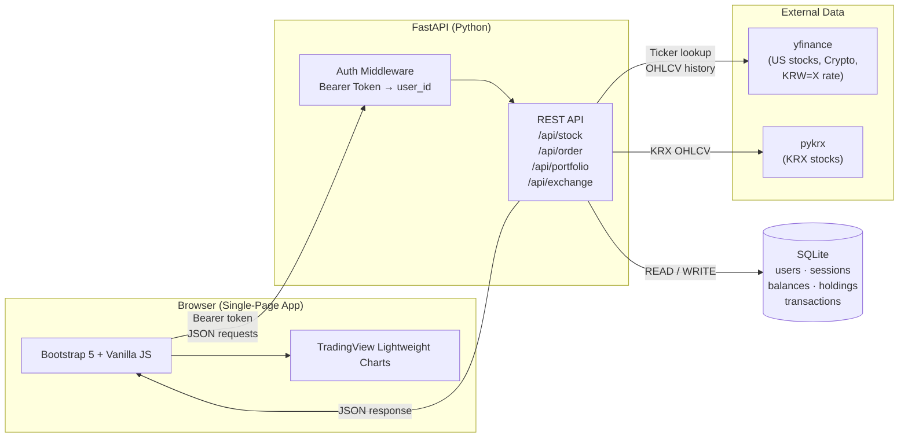

# PaperTrade

**Risk-free stock & crypto simulation platform with real market data — trade Korean, US, and crypto markets with virtual capital.**


---

## Demo

![PaperTrade Screenshot][SCREENSHOT HERE]

> Live demo: `http://localhost:8000` (run locally — see [Getting Started](#getting-started))

---

## Problem Statement

I built this because most paper-trading platforms either restrict access behind a paywall, limit you to US equities only, or provide a poor mobile experience. As someone actively investing in both the Korean and US markets, I wanted a single tool that lets me test strategies across all three asset classes — KRX stocks, NYSE/NASDAQ equities, and cryptocurrencies — using real-time price data, without risking actual capital.

---

## Features

| Feature | Details |
|---|---|
| **Multi-market trading** | Korean Exchange (KRX), US equities (NYSE/NASDAQ), and 20+ cryptocurrencies |
| **Real-time prices** | Live quotes via yfinance (US/Crypto) and pykrx (KR) with 30-second auto-refresh |
| **Google Finance–style charts** | Candlestick (1M / 6M / YTD / 1Y / 5Y) and line/area (1D / 5D) with period tabs |
| **Portfolio & P&L tracking** | Live unrealized P&L per holding, total return %, and balance overview |
| **Currency exchange** | Real-time KRW ↔ USD conversion with live mid-market rate (yfinance KRW=X); 1.75% spread fee applied at order execution — fee breakdown (mid rate, spread %, applied rate, amount received) shown before confirmation |
| **Multi-user authentication** | Per-user account with PBKDF2-SHA256 password hashing and session token auth |
| **Fractional crypto trading** | Buy 0.00001 BTC — no minimum lot size enforced for crypto |
| **Transaction history** | Full audit log of every buy, sell, and currency exchange |
| **Market hours awareness** | KRX and NYSE/NASDAQ trading locked outside official hours; crypto trades 24/7 |
| **Dark / Light mode** | Persistent theme toggle; chart recolors to match |
| **Korean / English UI** | Full bilingual interface persisted to localStorage |

---

## Tech Stack

| Category | Technology |
|---|---|
| **Backend** | Python 3.13, FastAPI, Uvicorn |
| **Database** | SQLite (auto-provisioned on first run) |
| **Market Data — US / Crypto** | yfinance |
| **Market Data — KR** | pykrx |
| **Exchange Rate** | yfinance (`KRW=X` ticker, 60 s cache) |
| **Frontend** | Vanilla JS, Bootstrap 5.3 (dark/light theming) |
| **Charting** | TradingView Lightweight Charts v4.1.3 |
| **Auth** | PBKDF2-SHA256 (stdlib `hashlib`), `secrets.token_urlsafe` session tokens |
| **Timezone handling** | pytz (KST for KRX, EST for NYSE) |

---

## Architecture



---

## Getting Started

### Prerequisites

- Python 3.10+
- pip

### Installation

```bash
# 1. Clone the repository
git clone https://github.com/J1NOwO/PaperTrade.git
cd Stockr-Simulator

# 2. Create and activate a virtual environment
python -m venv .venv

# Windows
.venv\Scripts\activate

# macOS / Linux
source .venv/bin/activate

# 3. Install dependencies
pip install -r requirements.txt
```

### Environment Variables

No `.env` file is required. All configuration is handled automatically:

| Variable | Default | Notes |
|---|---|---|
| Database path | `papertrade.db` | Created in project root on first run |
| Server host | `0.0.0.0` | Editable in `main.py` |
| Server port | `8000` | Editable in `main.py` |

### Run Locally

```bash
python main.py
```

Open **http://localhost:8000** in your browser.

On first launch you will be prompted to:
1. Create an account
2. Set your starting KRW and USD virtual balances

### Project Structure

```
Stockr-Simulator/
├── main.py          # FastAPI app — all API routes and auth middleware
├── database.py      # SQLite schema init, migrations, password hashing
├── stock_data.py    # Market data layer (yfinance, pykrx, exchange rate)
├── requirements.txt
└── static/
    └── index.html   # Entire frontend (SPA — HTML + CSS + JS, single file)
```

---

## What I Learned / Challenges

- **Multi-user data isolation without an ORM** — Designed a lightweight migration system in `database.py` that detects old single-user schema (absence of `user_id` FK) and transparently upgrades it on startup, avoiding the complexity of Alembic for a small project while keeping the upgrade path correct.

- **Real-time currency conversion at the order layer** — Wiring live KRW/USD rates into the order flow required a 60-second in-process cache to avoid blocking every transaction on a network call, and careful handling of floating-point precision when recording exchange transactions.

- **Serving intraday vs. daily chart data from the same endpoint** — The 1D/5D periods return Unix-timestamp line data from yfinance's minute-interval API, while 1M+ periods return date-string OHLCV candlestick data. The frontend dynamically swaps between `addAreaSeries` and `addCandlestickSeries` on TradingView Lightweight Charts based on the `chart_type` field the API returns.

- **Korean market (pykrx) vs. US market (yfinance) data normalization** — KRX data uses Korean column names (`종가`, `시가`, etc.), date-only indices, and integer share lots, while yfinance returns timezone-aware timestamps and allows fractional shares. Wrapping both behind a unified `get_stock_info` / `get_chart_data` interface kept the API layer completely market-agnostic.

- **Security without third-party auth libraries** — Implemented PBKDF2-SHA256 password hashing (260,000 iterations) and `secrets.compare_digest` for timing-safe comparison using only Python's stdlib, plus `secrets.token_urlsafe(32)` session tokens stored server-side — avoiding both JWT complexity and common token-in-cookie pitfalls.

---

## Roadmap

- [ ] **Watchlist** — Save tickers to a personal watchlist with price alerts
- [ ] **Leaderboard** — Public ranking of user portfolio returns across a shared simulation period
- [ ] **Backtesting mode** — Replay historical data at a chosen start date to evaluate past strategies

---

## License

Distributed under the MIT License. See [`LICENSE`](LICENSE) for details.

---

## Contact

**Jinwoo Yoon**
- LinkedIn: [linkedin.com/in/jinwoo-yoon](https://www.linkedin.com/in/jinwoo-yoon/)
- GitHub: [github.com/J1NOwO](https://github.com/J1NOwO)
